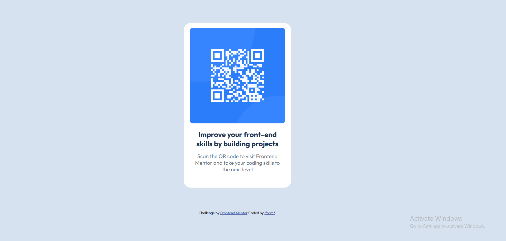

# Frontend Mentor - QR code component solution

This is a solution to the [QR code component challenge on Frontend Mentor](https://www.frontendmentor.io/challenges/qr-code-component-iux_sIO_H). Frontend Mentor challenges help you improve your coding skills by building realistic projects. 

## Table of contents

- [Overview](#overview)
  - [Screenshot](#screenshot)
  - [Links](#links)
- [My process](#my-process)
  - [Built with](#built-with)
  - [Continued development](#continued-development)
- [Author](#author)

## Overview

### Screenshot

### Links

- Solution URL: [Solution](https://github.com/Ifram3/frontendmentor.io-projects/tree/36cc63a98c660adb6a7f163b539cf8e03ee76735/qr-code-component-main)
- Live Site URL: [Live Site](https://qr-code-scanme.netlify.app/)

## My process

### Built with

- Semantic HTML5 markup
- CSS custom properties
- Flexbox
- Mobile-first workflow
- Google Fonts
- HSL color values
- Card layout pattern 

### Continued development

- **Media Queries:** As much as I did the basic required of me in this project, I would love to pay more attention to it and understand the concept better.

## Author

- Website - [qr-code-scanme](https://qr-code-scanme.netlify.app/)
- Frontend Mentor - [@Ifram3](https://www.frontendmentor.io/profile/Ifram3)
- Twitter - [@yourusername](https://www.twitter.com/i_Fram3)
