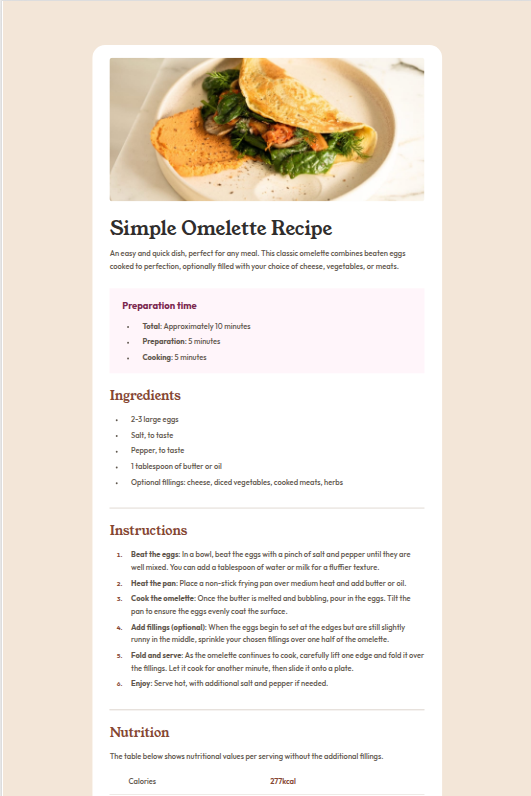

# Frontend Mentor - Recipe page solution

This is a solution to the [Recipe page challenge on Frontend Mentor](https://www.frontendmentor.io/challenges/recipe-page-KiTsR8QQKm). Frontend Mentor challenges help you improve your coding skills by building realistic projects. 

## Table of contents

- [Overview](#overview)
  - [Screenshot](#screenshot)
  - [Links](#links)
- [My process](#my-process)
  - [Built with](#built-with)
  - [What I learned](#what-i-learned)
  - [Continued development](#continued-development)
- [Author](#author)

## Overview

### Screenshot



### Links

- Solution URL: [Solution](https://github.com/Ifram3/RECIPE-PAGE)
- Live Site URL: [Live Site](https://tastyrecipepage.netlify.app/)

## My process

### Built with

- Semantic HTML5 markup
- CSS custom properties (for color palette and variables)
- Flexbox (for layout and alignment)
- Mobile-first workflow
- Responsive design with media queries
- Custom web fonts using @font-face
- Favicon for better branding
- Consistent design spacing using CSS gap & padding

### What I learned

- **Flex-Sizing**: I deepened my understanding of how **flex-grow**, **flex-shrink**, and **flex-basis** work together and how their shorthand property **flex** simplifies responsive layouts.

```css
.label {
    flex: 0 0 6.25rem;
}

.value {
    flex: 1;
}
```
This helped me align text perfectly in my nutrition section without using traditional table elements.

### Continued development

- **Flexbox mastery**: I want to keep refining my understanding of how flex sizing behaves in different contexts, especially when combining flex-basis, min-width, and max-width.

- **CSS layout systems**: As time goes on, I’d like to explore CSS Grid to handle more complex layouts that go beyond one-dimensional flex arrangements.

## Author

- Website - [iFram3](https://tastyrecipepage.netlify.app/)
- Frontend Mentor - [@ifram3](https://www.frontendmentor.io/profile/ifram3)
- Twitter - [@i_Fram3](https://www.twitter.com/i_Fram3)