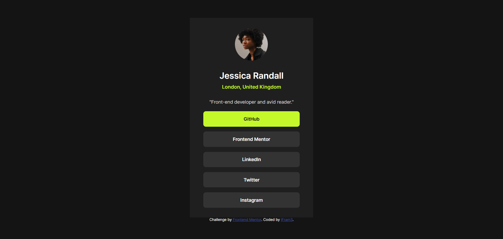

# Frontend Mentor - Social links profile solution

This is a solution to the [Social links profile challenge on Frontend Mentor](https://www.frontendmentor.io/challenges/social-links-profile-UG32l9m6dQ). Frontend Mentor challenges help you improve your coding skills by building realistic projects. 

## Table of contents

- [Overview](#overview)
  - [The challenge](#the-challenge)
  - [Screenshot](#screenshot)
  - [Links](#links)
- [My process](#my-process)
  - [Built with](#built-with)
  - [Continued development](#continued-development)
- [Author](#author)

## Overview

### The challenge

Users should be able to:

- See hover and focus states for all interactive elements on the page

### Screenshot

### Links

- Solution URL: [Solution](https://github.com/Ifram3/frontendmentor.io-projects/tree/main/social-links-profile-main)
- Live Site URL: [Live Site](https://biogrid.netlify.app/)

## My process

### Built with

- Semantic HTML5 markup
- CSS custom properties (for color variables)
- Flexbox (for layout and alignment)
- Responsive design (using media queries)
- Custom fonts with @font-face
- Mobile-first workflow

### Continued development

- **Responsive design techniques:** Refining how layouts adapt across various screen sizes beyond basic media queries.

- **Design consistency:** Experimenting with design systems, spacing scales, and typography hierarchy to create more balanced UIs.

## Author

- Website - [iFram3](https://biogrid.netlify.app/)
- Frontend Mentor - [@ifram3](https://www.frontendmentor.io/profile/ifram3)
- Twitter - [@i_Fram3](https://www.twitter.com/i_Fram3)
